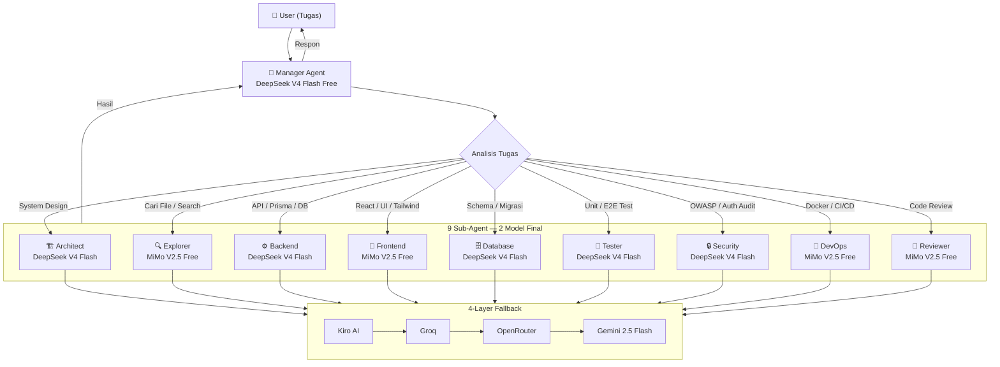
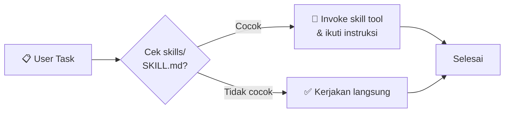
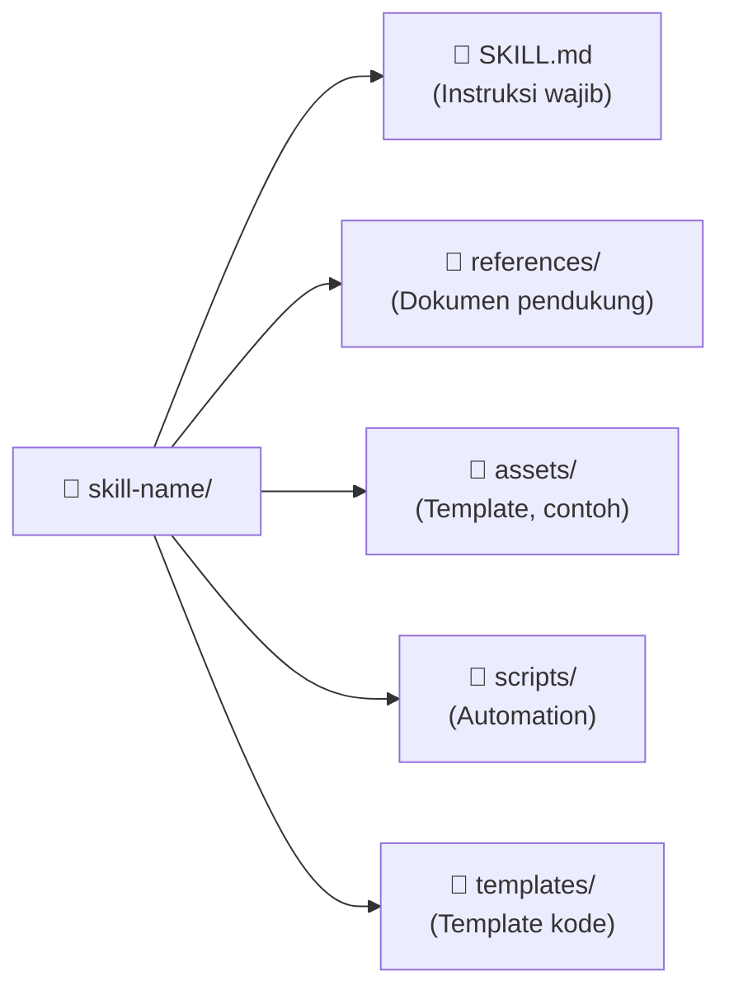

# Struktur Agent & Skill — Flow Diagram

## 1. Agent Flow

---

## 2. Skill Discovery Flow

---

## 3. Struktur Folder Skill

---

## 4. Agent & Model Assignment

| Agent | Model | Alasan |
|-------|-------|--------|
| **Manager** | DeepSeek V4 Flash Free | Orkestrasi & delegasi |
| **Architect** | DeepSeek V4 Flash Free | Logika arsitektur & skema |
| **Backend** | DeepSeek V4 Flash Free | Presisi sintaks, Prisma, RBAC |
| **Database** | DeepSeek V4 Flash Free | Ketepatan query & migrasi |
| **Tester** | DeepSeek V4 Flash Free | Akurasi assertion & coverage |
| **Security** | DeepSeek V4 Flash Free | Rule-based analysis |
| **Explorer** | MiMo V2.5 Free | 1M context — jelajah file |
| **Frontend** | MiMo V2.5 Free | 1M context — lihat component tree |
| **Reviewer** | MiMo V2.5 Free | 1M context — review seluruh codebase |
| **DevOps** | MiMo V2.5 Free | Banyak baca config, sedikit generate |

---

## 5. Change Log

| Tanggal | Perubahan |
|---------|-----------|
| 19 Jun 2026 | Final: 2 model (DeepSeek V4 Flash + MiMo V2.5). Logic → DeepSeek, Context → MiMo. |
